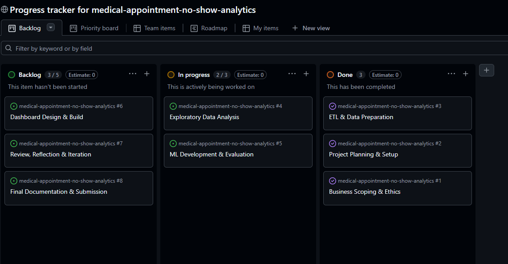
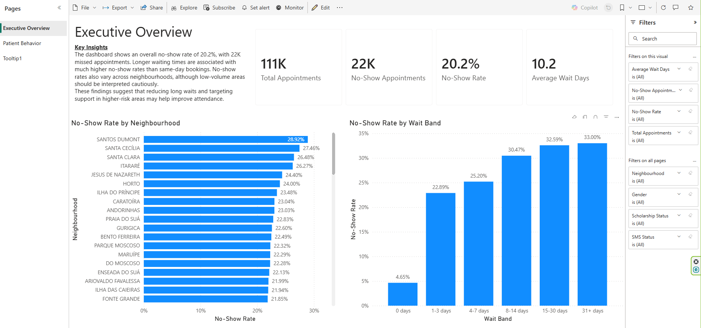
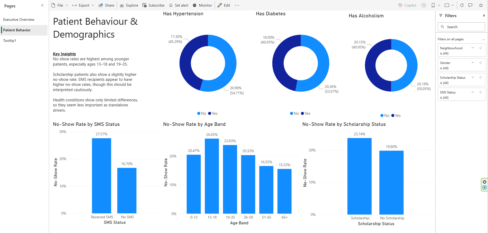
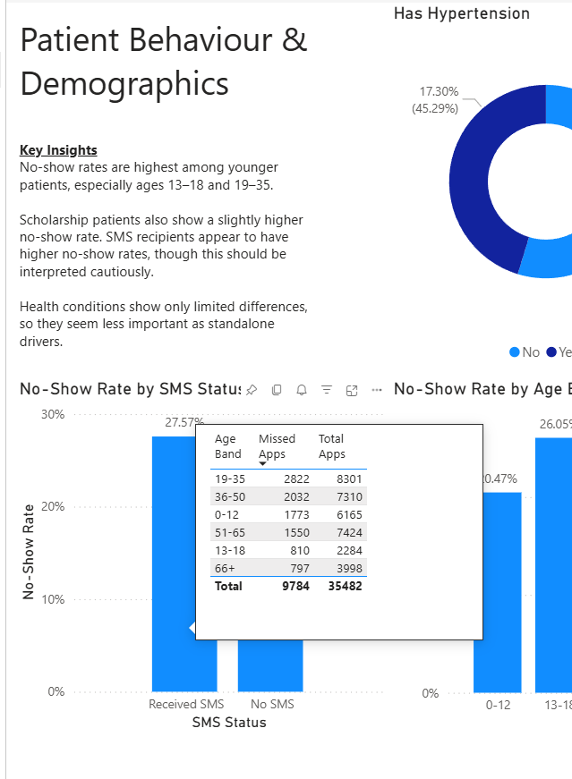

# Medical Appointment No-Show Analytics
### An end-to-end data science workflow using Python & Power BI to predict patient attendance through an ethics-aware lens.

## Table of Contents
- [Overview](#overview)
- [Project Structure](#project-structure)
- [Dataset Content](#dataset-content)
- [Business Requirements](#business-requirements)
- [Project Management](#project-management)
- [Project Hypotheses and Validation](#project-hypotheses-and-validation)
- [Hypothesis Validation Summary](#hypothesis-validation-summary)
- [Project Plan](#project-plan)
- [Data Collection, Cleaning and Preparation](#data-collection-cleaning-and-preparation)
- [Exploratory Data Analysis](#exploratory-data-analysis)
- [Machine Learning Modelling](#machine-learning-modelling)
- [The Rationale to Map the Business Requirements to the Data Visualisations](#the-rationale-to-map-the-business-requirements-to-the-data-visualisations)
- [Analysis Techniques Used](#analysis-techniques-used)
- [Ethical Considerations](#ethical-considerations)
- [Dashboard Design](#dashboard-design)
- [Key Findings](#key-findings)
- [Unfixed Bugs](#unfixed-bugs)
- [Development Roadmap](#development-roadmap)
- [Deployment](#deployment)
- [Main Data Analysis Libraries](#main-data-analysis-libraries)
- [Credits](#credits)
- [Acknowledgements](#acknowledgements)

---

## Overview

This project analyses medical appointment no-show behaviour using a structured data analytics workflow covering ETL, exploratory data analysis, machine learning, and dashboard design.

The main aim of the project is to identify the factors most associated with missed appointments and to build a predictive workflow that can help support earlier intervention, better appointment planning, and more informed operational decision-making.

The project is organised into separate notebooks for ETL, EDA, and machine learning, alongside dashboard files, processed data outputs, and supporting images. The work was completed using a business-focused and ethics-aware approach, with particular care taken around privacy, fairness, and the interpretation of potentially sensitive features.

---

## Project Structure

The repository is organised so that each stage of the analytics workflow has a clear location for inputs, outputs, notebooks, and dashboard assets.

```text
medical-appointment-no-show-analytics/
├── dashboards/
│   └── 04_medical_noshow_analytics_v1.pbix
├── data/
│   ├── raw/
│   │   └── KaggleV2-May-2016.csv
│   └── processed/
│       ├── medical_appointments_cleaned.csv
│       ├── models/
│       │   └── v1/
│       └── outputs/
│           └── v1/
├── images/
│   ├── 04_dashboard_excutive_overview.png
│   ├── 04_dashboard_patient_behavior.png
│   ├── 04_dashboard_tooltip_custom.png
│   └── 05_github_project_board.png
├── jupyter_notebooks/
│   ├── 01_ETL.ipynb
│   ├── 02_VIS.ipynb
│   └── 03_ML.ipynb
├── README.md
└── requirements.txt
```

The project is organised into separate folders for notebooks, processed data, dashboard assets, and supporting images so that each stage of the workflow is easy to follow and review.

---

## Dataset Content

The dataset used in this project is the **Medical Appointment No Shows** dataset, sourced from **Kaggle**. It contains appointment booking information, patient characteristics, health-related indicators, and a target field showing whether the patient attended or missed the appointment.

After the ETL and cleaning stage, the final working dataset contained **110,521 rows and 22 columns**. In addition to the original fields, new analytical features were created to better support exploratory analysis and modelling. These included:

- `wait_days`
- `scheduled_hour`
- `scheduled_day_of_week`
- `appointment_day_of_week`
- `no_show_flag`
- `has_handicap`
- `same_day_appointment`
- `row_id`

The cleaned dataset was then used as the input for both the EDA and machine learning stages of the project.

---

## Business Requirements

The business requirements for this project were:

- to understand the main patterns associated with appointment no-shows
- to test a set of business-focused hypotheses using exploratory analysis
- to identify which patient, scheduling, and appointment factors appear most relevant
- to build a machine learning model capable of predicting likely no-shows
- to communicate the findings clearly through a Power BI dashboard for both technical and non-technical audiences
- to ensure that privacy, fairness, and ethical use were considered throughout the project rather than only at the end

This project was designed as a decision-support exercise. The goal is to improve understanding and support planning, not to make automated or punitive decisions about individual patients.

---

## Project Management

This project was managed using a GitHub Project Board to organise the work into clear phases and track progress across the full analytics workflow.

The board was structured using three workflow stages:

- **Backlog** for planned work not yet started
- **In Progress** for active tasks being worked on
- **Done** for completed stages of the project

This helped keep the workflow structured and made it easier to manage the project from business scoping and ethics through to ETL, analysis, modelling, dashboard design, and final documentation.

### GitHub Project Board

The project workflow was planned and tracked using a GitHub Project Board.



---

## Project Hypotheses and Validation

The exploratory analysis was structured around six project hypotheses designed to test whether no-show behaviour was associated with different patient, scheduling, socioeconomic, and health-related characteristics.

### Hypothesis 1: Lead Time Impact
**Business question:**  
Are patients with longer wait times between booking and appointment more likely to miss their appointment?

### Hypothesis 2: Reminder Effect
**Business question:**  
Do SMS reminders appear to reduce the likelihood of a patient missing their appointment?

### Hypothesis 3: Age Demographics
**Business question:**  
Do no-show rates vary across age groups, with younger adults more likely to miss appointments?

### Hypothesis 4: Temporal Patterns
**Business question:**  
Are appointments on certain weekdays associated with higher no-show rates than others?

### Hypothesis 5: Socio-economic / Access Factors
**Business question:**  
Do patients with indicators of greater socioeconomic or access-related disadvantage show different no-show behaviour?

#### Hypothesis 5a: Scholarship
**Business question:**  
Is scholarship status associated with appointment attendance behaviour?

#### Hypothesis 5b: Neighbourhood
**Business question:**  
Are there location-based differences in no-show behaviour?

### Hypothesis 6: Health Profile
**Business question:**  
Do patients with chronic health conditions show different attendance patterns compared with patients without those conditions?

These hypotheses were validated through comparative visual analysis using appropriate chart types for numeric and categorical features. The focus of this stage was on identifying interpretable business patterns rather than relying only on formal statistical testing.

---

## Hypothesis Validation Summary

The table below summarises the main outcome of each project hypothesis following exploratory analysis. Validation was based on visual and comparative analysis of the cleaned dataset, with findings interpreted in a business and ethics-aware context.

| Hypothesis | Summary Finding | Outcome |
|---|---|---|
| Lead Time Impact | Longer waiting times appeared to be associated with higher no-show behaviour. | Supported |
| Reminder Effect | SMS reminder patterns showed some differences in no-show behaviour, but the relationship should be interpreted cautiously. | Partially supported |
| Age Demographics | Attendance behaviour varied across age groups, suggesting age had an association with no-show patterns. | Supported |
| Temporal Patterns | Some weekday variation was visible, although the differences were less pronounced than other factors. | Partially supported |
| Socio-economic / Access Factors | Scholarship status and neighbourhood both showed variation in no-show behaviour, suggesting wider access-related or social factors may play a role. | Supported |
| Hypothesis 5a: Scholarship | Patients with a scholarship showed a different no-show pattern from those without a scholarship. | Supported |
| Hypothesis 5b: Neighbourhood | No-show behaviour varied across neighbourhoods, with some areas showing higher no-show rates than others. | Supported |
| Health Profile | Patients with chronic health-condition indicators showed different attendance patterns compared with patients without those indicators. | Supported |

---

## Project Plan

The project was planned and tracked through a GitHub Project Board. Rather than treating the work as one large task, it was broken into a series of defined project stages.

The board was used to move work through backlog, in progress, and done stages so that the project could be tracked from initial scoping through to final documentation and submission.

### Project phases

#### 1. Business Scoping & Ethics
This phase focused on defining the problem, setting the business requirements, and identifying ethical considerations early in the project. This included thinking about privacy, fairness, sensitive features, and the responsible use of predictive modelling in a healthcare-related context.

#### 2. Project Planning & Setup
This phase focused on setting up the repository structure, preparing the working environment, and organising the notebooks, folders, and outputs needed for the project workflow.

#### 3. ETL & Data Preparation
This phase covered data loading, cleaning, transformation, feature engineering, and preparation of the final cleaned dataset for analysis and modelling.

#### 4. Exploratory Data Analysis
This phase focused on testing the project hypotheses and identifying key patterns in no-show behaviour through visual and comparative analysis.

#### 5. ML Development & Evaluation
This phase focused on building, comparing, and evaluating classification models to predict likely no-shows, with model selection based on the most appropriate performance metrics for the business goal.

#### 6. Dashboard Design & Build
This phase focused on translating the analytical findings into a Power BI dashboard that could communicate key insights clearly to both technical and non-technical users.

#### 7. Review, Reflection & Iteration
This phase focused on reviewing the outputs, refining the analysis, checking consistency across notebooks and dashboard outputs, and reflecting on areas for improvement.

#### 8. Final Documentation & Submission
This phase focused on preparing the README, checking that the project met the assessment criteria, and ensuring the final submission was clearly documented and presented.

---

## Data Collection, Cleaning and Preparation

The ETL stage prepared the raw dataset for both exploratory analysis and predictive modelling.

In this stage, column names were standardised, date fields were converted to usable formats, and new features were engineered to support more meaningful analysis. Key engineered fields included `wait_days`, `no_show_flag`, `has_handicap`, and `same_day_appointment`.

Invalid records were then removed, including:

- rows with negative ages
- rows with impossible negative waiting times

Age values of 0 were retained because they may represent infants under 1 year old.

Privacy and governance were also considered during ETL. The `patient_id` and `appointment_id` columns were removed because they did not add explanatory value to the business questions and because retaining them would not support privacy-aware, governance-focused analysis. Instead, a non-identifying `row_id` field was created for possible later use in the visualisation stage.

The cleaned dataset was then saved for use in the EDA and modelling notebooks.

---

## Exploratory Data Analysis

The exploratory analysis stage was used to test the project hypotheses and identify the main factors associated with appointment no-shows.

The cleaned dataset used for this stage contained **110,521 rows and 22 columns**. Visualisations were created using `matplotlib` and `seaborn` to compare no-show behaviour across numeric and categorical variables, including:

- waiting time
- age
- day-based features
- reminder status
- neighbourhood

A key strength of this stage was that it did not treat all patterns as purely behavioural. Some findings may reflect broader structural inequalities rather than purely individual behaviour, so results were interpreted cautiously and at an aggregated level. This was especially important when reviewing features such as neighbourhood, scholarship status, age, and health conditions.

The EDA stage therefore supported both analytical insight and ethical interpretation by highlighting patterns while avoiding simplistic or overly individualised conclusions.

---

## Machine Learning Modelling

The machine learning stage focused on predicting whether a patient was likely to miss their appointment.

Two classification models were developed and compared:

- **Logistic Regression** as the baseline model
- **Random Forest** as the comparison model

Model evaluation used a range of classification metrics so that performance could be assessed more fully than by accuracy alone.

### Model comparison summary

| Model | Accuracy | Precision | Recall | F1 Score | ROC AUC |
|---|---:|---:|---:|---:|---:|
| Logistic Regression | 0.6546 | 0.3107 | 0.5832 | 0.4055 | 0.6687 |
| Random Forest | 0.5678 | 0.2985 | 0.8449 | 0.4412 | 0.7193 |

Although Logistic Regression achieved higher accuracy, Random Forest performed better on recall, F1-score, and ROC AUC.

Because the project objective was to better identify likely no-shows, **recall** was especially important. For that reason, **Random Forest** was selected as the stronger final model.

Threshold tuning was also reviewed. A threshold of **0.5** gave the best overall balance in the tested range, with the strongest F1-score while still maintaining strong recall.

The final selected Random Forest pipeline was then saved for reuse.

**Why Recall?** In a healthcare setting, the cost of missing a "no-show" (a False Negative) is higher than accidentally sending a reminder to someone who was going to show up anyway. By prioritizing Recall, we ensure the model captures as many potential missed appointments as possible.

---

## The Rationale to Map the Business Requirements to the Data Visualisations

The data visualisations were chosen to directly support the business requirements of the project.

| Business Requirement | Visualisation Approach | Rationale |
|---|---|---|
| Understand the overall scale of the no-show issue | KPI cards and summary visuals | Gives a quick operational overview of the problem |
| Identify whether waiting time is associated with no-shows | Boxplots, distributions, and grouped comparisons | Helps show how missed appointments vary by lead time |
| Explore demographic and behavioural patterns | Bar charts and count-based visuals | Makes differences between patient groups easier to interpret |
| Examine temporal and scheduling effects | Day-of-week and time-based visuals | Supports practical scheduling insight |
| Communicate findings clearly to business users | Dashboard pages with structured summaries and tooltips | Makes technical analysis more accessible |

This mapping helped ensure that the visuals were not added for presentation only, but were selected to answer specific project questions and support business interpretation.

---

## Analysis Techniques Used

A range of analysis techniques were used across the project.

### ETL and feature engineering
Data cleaning, column standardisation, date conversion, and new feature creation were used to prepare the dataset for downstream analysis.

### Exploratory analysis
Comparative visual analysis was used to test six business-focused hypotheses and identify practical patterns in no-show behaviour.

### Machine learning
Classification modelling was used to predict no-show risk. Logistic Regression was used as a baseline model and Random Forest was used as a more flexible comparison model. Performance was evaluated using:

- accuracy
- precision
- recall
- F1-score
- ROC AUC

Threshold tuning was also used to support model selection.

### Workflow structure
The project was structured in separate ETL, EDA, and ML notebooks so that each stage had a clear purpose and output. This helped keep the workflow easier to review, validate, and document.

### Use of generative AI
Generative AI tools were used to support ideation, project structuring, explanation refinement, and code troubleshooting. All final project decisions, code implementation, notebook interpretation, and written reflections were reviewed and validated by the project author.

---

## Ethical Considerations

Ethics was an important part of this project and was considered throughout ETL, EDA, modelling, and dashboard interpretation.

### Data privacy and governance
Direct identifier fields were removed from the final cleaned dataset because they were not needed for analysis and would not support privacy-aware, governance-focused work. A non-identifying `row_id` was used instead where needed.

### Bias and fairness
Some variables in the dataset may reflect structural disadvantage rather than simple patient choice. Findings relating to neighbourhood, scholarship, age, and health-related factors were interpreted cautiously and at an aggregated level because they may reflect broader structural inequalities rather than purely individual behaviour.

### Health-related features
Health-related variables may improve model performance but also raise ethical questions about how health information is used in decision-making. In this project, these features were used only for exploratory modelling and interpretation.

### Responsible model use
The model developed in this project should be treated as a **decision-support tool** rather than an automated decision-maker. It may help identify appointments that could benefit from reminders, support, or better scheduling, but it should not be used to deny access to care, deprioritise patients, or make unfair assumptions about individuals.

### Legal and societal considerations
Because the dataset relates to healthcare appointments and includes potentially sensitive characteristics, this project was approached with a strong focus on minimising re-identification risk, avoiding harmful interpretation, and keeping the analysis at a level suitable for insight generation rather than individual-level judgement.

---

## Dashboard Design

The dashboard stage was designed to communicate the key findings from the project in a clearer and more accessible way.

The dashboard was designed to support both technical and non-technical audiences by combining high-level summary views with more detailed exploratory visuals.

### Executive Overview

This page provides a high-level summary of the project through KPI cards, key no-show metrics, and headline insights. It was designed to give users a quick understanding of the scale of the issue and the main factors influencing missed appointments.



### Patient Behaviour

This page focuses more closely on behavioural and demographic patterns in the data, including variables such as wait time, age, reminder status, and related appointment features. It supports more detailed analysis of the trends identified during EDA.



### Custom Tooltip Page

This page was created to support the main visuals without overcrowding the main report pages. It allows additional detail to be shown on hover, helping users explore the data in more depth while keeping the main dashboard cleaner and easier to read.



### Dashboard design approach

The design approach focused on making insights easy to understand while still keeping enough detail for analytical review. In practice, this meant using:

- KPI cards
- grouped charts
- filters
- tooltip pages
- short narrative summaries

This helped improve usability for different audiences while keeping the visuals aligned to the business requirements.

---

## Key Findings

The project found that appointment no-show behaviour is not random and appears to be associated with a combination of scheduling, timing, patient, and location-based factors.

The exploratory analysis identified several meaningful patterns across the six hypotheses, including an observed association between neighbourhood and no-show behaviour. The machine learning stage then showed that no-show risk can be predicted to a useful degree, with Random Forest performing better than Logistic Regression on recall, F1-score, and ROC AUC.

These findings suggest that healthcare providers may be able to reduce missed appointments through earlier identification of higher-risk bookings and more targeted reminder or support strategies. However, any such use should remain ethically cautious and should avoid treating model output as a substitute for human judgement.

---

## Unfixed Bugs

At the current stage of the project, there are no major known bugs that prevent the main workflow from running as intended. The notebooks are separated by stage and the core outputs are saved into structured folders for reuse.

One known limitation in the ML notebook is that some exports are conditional on whether specific dataframes were created earlier in the notebook. For example, feature importance export may be skipped if the dataframe has not been created. This does not break the final workflow, but it does show that the export section could be made more robust in a future version.

A second limitation is that dashboard polish and presentation can continue to be refined, particularly where narrative summaries, layout consistency, or tooltip design could be strengthened further.

---

## Development Roadmap

Although the core project workflow was structured and delivered through the GitHub Project Board phases, there are still several areas that could be improved in a future iteration of the project.

Possible next steps include:

- further model tuning and comparison with additional algorithms
- more detailed fairness review across relevant subgroups
- stronger explainability outputs for the final selected model
- adding a dedicated model risk and ethics dashboard page to show feature importance, subgroup performance, and fairness checks
- additional dashboard refinement and interaction improvements
- extending the project into a more reusable or semi-automated analytical product

One of the main reflections from this project is that technical performance alone is not enough. Future development would therefore place even more emphasis on fairness, interpretability, and responsible use.

---

## Deployment

This project is currently structured as a repository-based analytics project rather than a fully deployed web application.

The main project components are stored in the GitHub repository, including:

- Jupyter notebooks for ETL, EDA, and ML
- processed data outputs
- dashboard files
- project images and supporting assets

This structure supports reproducibility and project review, while keeping each stage of the workflow clearly separated.

# Clone the repo
```bash
   git clone [https://github.com/RNB1993/medical-appointment-no-show-analytics.git](https://github.com/RNB1993/medical-appointment-no-show-analytics.git)
```
# Install dependencies
```bash
pip install -r requirements.txt
```
# Run the ETL notebook first

01_ETL.ipynb → 02_VIS.ipynb → 03_ML.ipynb
---

## Main Data Analysis Libraries

The main libraries used in this project include:

- `pandas` for loading, cleaning, reshaping, and exporting data
- `numpy` for numerical operations
- `matplotlib` for charting and visual analysis
- `seaborn` for higher-level statistical visualisations in EDA
- `scikit-learn` for preprocessing, modelling, and evaluation
- `joblib` for saving the final trained model pipeline

---

## Credits

### Content
- Medical Appointment No Shows dataset
- Code Institute data analytics template repository
- Official documentation for Python libraries used in the project, including pandas, seaborn, matplotlib, scikit-learn, and joblib

### Media
- Dashboard screenshots and project images created as part of the project and stored in the repository

### Support and learning
- Code Institute learning materials and project guidance
- Generative AI support for ideation, structure, and debugging assistance, with all final implementation reviewed by the project author

---

## Acknowledgements

Thanks to the instructors (**Vasi, Mark, and Neil**), walkthrough materials, and feedback sources that supported the development of this project, as well as the broader learning content that helped shape the analytical and ethical approach used throughout.